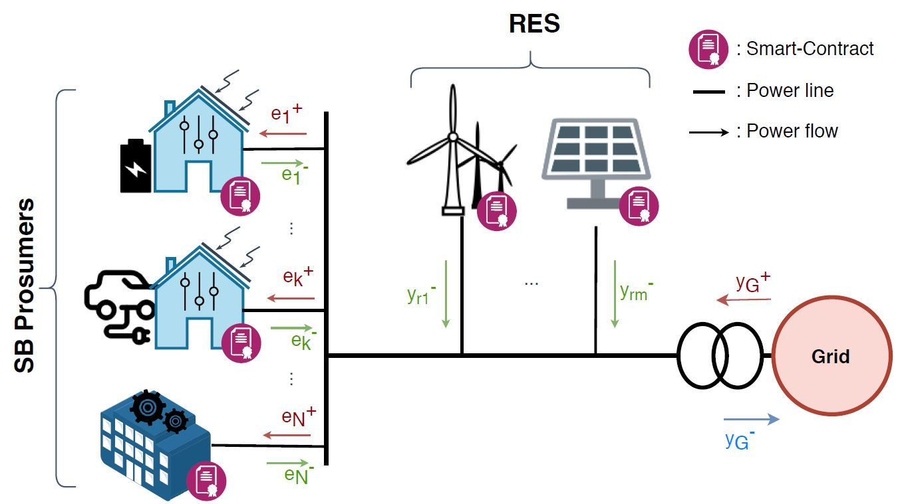

# Source

This repo is downloaded from gitlab [repo](https://gitlab.com/olivancu/blockchain-dr-microgrid)
and associated with the paper **Cooperative energy management of a community of smart-buildings: A Blockchain approach**

# ELAB blockchain-based decentralized energy management in a smart-buildings community simulation project

## Setup

1. Download the git project:

`git clone git clone https://gitlab.com/olivancu/blockchain-dr-microgrid.git`

or

`git clone https://github.com/WangChuan157/EnergyManagement.git`

2. Install the NodeJS dependency:

In the main directory:

`npm install`

3. Install the Ganache-cli, a command-line blockchain for Ethereum development

`npm install -g ganache-cli`

ganache-cli documentation: https://github.com/trufflesuite/ganache-cli

4. Download and install GUROBI Optimizer:

Follow instructions on: http://www.gurobi.com/downloads/download-center

## Run a simulation

0. Configure the simulation:

In config/simulation_config.json, specify the type of simulation you want to launch and the number of entities in the community

1. Lauch the ganache-cli Blockchain:

In a terminal, simply run: 

`ganache-cli`

2. Deploy the smart contracts on the running Blockchain:

In the "truffle/" directory:

compile the smart contracts: `truffle compile`

migrate the smart contracts to the Blockchain: `truffle migrate`

link the smart contracts address with the NodeJS' Web3 API: change the contracts addresses in "config/dr_smart_contracts.json" to the addresses outputted by the migration step.

3. Launch and control the simulation:

In a terminal, type:
`npm start`
this command deploy the NodeJS server and instanciate the Python entities for the simulation

Then you can connect to `http://localhost:8080/` to start/stop the simulation and vizualize the simulation

ddace230-2079-11ea-9642-0a7c4f30bdbe
